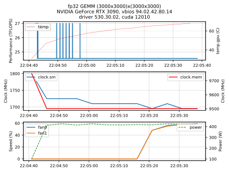

# What is it

Yet Another GEMM Application (YAGA) to run dense matrix-matrix
multiplications on GPUs and measure the acheived flops as a function
of time. Supports multiple GPUs on a single node.


<p align="center">
   
</p>


# Requirements

- cmake
- cuda


# Build

```bash
mkdir build
cd build
cmake ..
make
```


# Usage

```bash
yaga \
   -m 8192 \
   -n 8192 \
   -k 8192 \
   -i 10 \
   -r 10 \
   -p fp32 \
   -d DEVICE_LIST \
   -o $(hostname)_dgemm.json
```

Where
   - `m` is row count of matrix A
   - `n` is column count of matrix A
   - `k` is column count of matrix B
   - `i` is iteration count to perform
   - `p` ('fp32', 'fp64') specifes the gemm data type (single or double)
   - `r` is number of repetitions of dgemm to perform when evaluating
     flops
   - `d` is a comma separated list of device ids to use, indexed at
     zero. For single gpus you can leave empty to use device 0


# Output

GEMM operations on each gpu is ran asynchronously, and the data
printed to stdout aims only to show progress the progress for each
gpu. Summary of the results are dumped to stdout at the end of the
run.

If an output file is specified, the complete data for each iteration
including timestamps are outputed to file in either json or csv
format, depending on the specific output file extension via `-o`.


## json

Default output format is json unless `csv` extension is specified in
output filename. The results per iteration are recorded along with the
local timestamp when the flop-rate was estimated. Example output is
shown below

```text
{
  "system":{
     "driver": "530.30.02",
     "cuda": 12010
  },
  "devices": [
     {
        "id": 0,
        "name": "NVIDIA GeForce RTX 3090",
        "vbios": "94.02.42.80.14",
        "busid": "00000000:2D:00.0",
        "fans": 2
     }
  ],
  "perf": [
     {
        "id": 0,
        "t": [
           "2023-04-08 20:54:26.348",
           "2023-04-08 20:54:26.837",
           "2023-04-08 20:54:27.327"
        ],
        "flops": [
           0.552147,
           0.552147,
           0.552147
        ],
     },
  ],
  "states": [
     {
        "id": 0,
        "t": [
           "2023-04-08 20:54:23.892",
           "2023-04-08 20:54:28.894",
           "2023-04-08 20:54:33.896"
        ],
        "temp.gpu": [
            32, 37, 38
        ],
        "power":[
            104744, 185047, 185823
        ],
        "clock.sm": [
          1800, 1980, 1980
        ],
        "clock.mem": [
          9751,9501,9501
        ],
        "fans.speed":[
          [0,0], [0,0], [0,0]
        ]
     }
  ],
  "args": {
     "m": 3000,
     "n": 3000,
     "k": 3000,
     "i": 1000,
     "r": 5,
     "p": "fp64",
     "o":"fp64.json",
     "d": [0]
  }
}
```

Notes:
  - Timestamps output format is in `YYYY-mm-dd HH:MM:SS.ZZZ`
  - device ids are indexed at zero
  - `fans.speed` are the *target* fan speed, in percentage, at a given
    point in time
  - `clock.<>` are in MHz
  - `power` is in milliwatts


## csv

If the output file name has `csv` as extension, data is written in
comma-saparated format. There is a single header line, followed by
data, where the header for this case is as follows

```text
t_<N>,flops_<N>,[...]
```

where `N` is an integer representing the device id. Device ids are not
guaranteed to be ordered.

Example csv output:

```text
t_7,flops_7,t_6,flops_6,t_1,flops_1
"2021-08-09 09:55:52.745",8.168734,"2021-08-09 09:55:55.327",8.132482,"2021-08-09 09:55:55.441",8.291943
"2021-08-09 09:55:54.094",8.156614,"2021-08-09 09:55:56.681",8.126472,"2021-08-09 09:55:56.769",8.285694
"2021-08-09 09:55:55.443",8.150568,"2021-08-09 09:55:58.036",8.114477,"2021-08-09 09:55:58.097",8.279455
```
